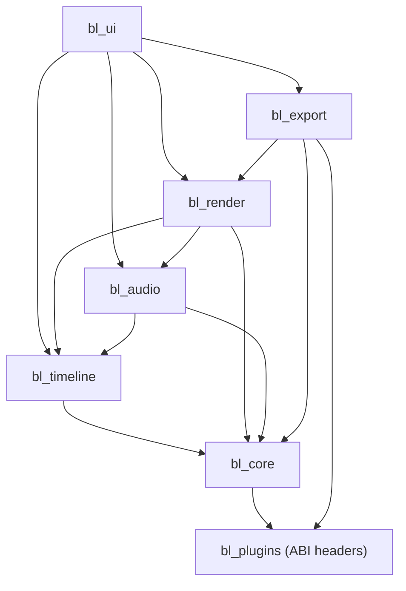
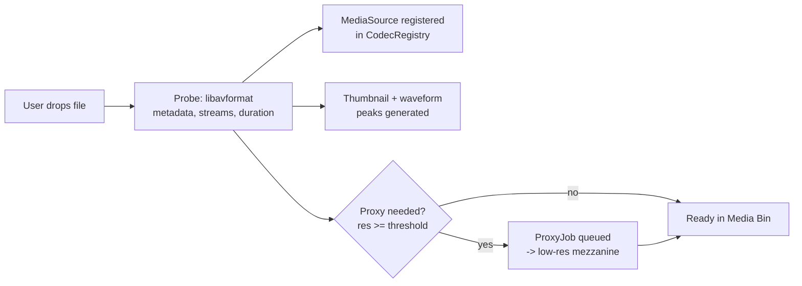
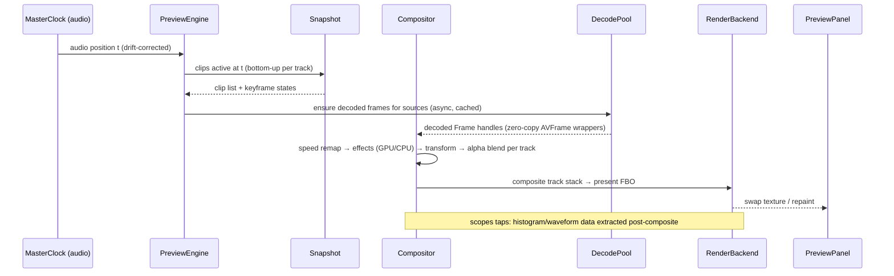

# Bucharest Lite — System Architecture

| | |
|---|---|
| **Version** | 1.1.1 |
| **Status** | APPROVED — Gate 1 passed (L Hustla, 2026-08-25) |
| **Scope** | All 20 essential features defined in `FEATURES.md` |
| **Related** | `FEATURES.md`, `ORCHESTRATOR.md`, `PROJECT_STATUS.md` |

---

## Table of Contents

1. [Overview & Goals](#1-overview--goals)
2. [Tech Stack & Dependencies](#2-tech-stack--dependencies)
3. [High-Level Architecture](#3-high-level-architecture)
4. [Module Dependency Graph](#4-module-dependency-graph)
5. [Core Concepts & Domain Model](#5-core-concepts--domain-model)
6. [Threading Model](#6-threading-model)
7. [Data Flow Diagrams](#7-data-flow-diagrams)
8. [Module Specifications](#8-module-specifications)
9. [Plugin API Specification](#9-plugin-api-specification)
10. [Codec Plugin Interface Spec](#10-codec-plugin-interface-spec)
11. [Persistence & Autosave](#11-persistence--autosave)
12. [Proxy Workflow](#12-proxy-workflow)
13. [Performance Budgets](#13-performance-budgets)
14. [Cross-Platform Strategy](#14-cross-platform-strategy)
15. [Licensing & Compliance](#15-licensing--compliance)
16. [Feature Traceability Matrix](#16-feature-traceability-matrix)
17. [Implementation Task Breakdown](#17-implementation-task-breakdown)
18. [Risks & Open Questions](#18-risks--open-questions)
19. [Deviations from ORCHESTRATOR.md](#19-deviations-from-orchestratormd)
20. [Gate 1 Sign-Off](#20-gate-1-sign-off)

---

## 1. Overview & Goals

Bucharest Lite is an open-source (GPL-3.0) cross-platform non-linear video editor (NLE) built on Qt6/C++17 with FFmpeg for media IO and GPU-accelerated compositing.

### Primary goals

- G1. Implement all 20 essential features (`FEATURES.md` §Essential Features) as a coherent, shippable v1.
- G2. Modular codec support: every codec is a dynamically loaded plugin; the core ships a registry + loader, never hardcodes codec logic.
- G3. Frame-accurate editing and playback driven by rational time arithmetic (no floating-point time).
- G4. Smooth proxy-based editing of high-resolution media on modest hardware.
- G5. Deterministic, offline-render-grade export pipeline that reuses the exact preview composition code path.
- G6. Cross-platform: Linux first-class, Windows and macOS supported from day one via CI.

### Non-goals for v1 (deferred / stretch)

- Multi-cam editing, motion tracking, stabilization (advanced list in FEATURES.md).
- Auto-subtitle generation (Whisper/VOSK integration).
- Node-based color grading, OCIO color management (v1 = sRGB + 3D LUT `.cube` import).
- Online resource marketplace integration.
- Nested compositions — deferred to v2 by decision D2 (§18).
- **GPU-accelerated preview/rendering** — v1 ships a CPU compositor (`src/render/compositor.cpp`, §19.3); the OpenGL 3.3 backend in §2/§19 is planned, not shipped.
- **Proxy-based editing** (goal G4) — unimplemented in v1; high-res media plays directly via demand decode.
- **Matroska export** — MP4/WebM only in v1; see `docs/user-guide.md` (Known limitations).

---

## 2. Tech Stack & Dependencies

| Component | Choice | Version | Notes |
|---|---|---|---|
| Language | C++ | 17 | GCC 11+, Clang 14+, MSVC 2019+ |
| Build | CMake | 3.20+ | Presets per platform in `CMakePresets.json` |
| GUI toolkit | Qt6 | 6.4+ | QtBase, QtSvg, QtMultimedia (audio device IO), QtOpenGL |
| Media IO | FFmpeg | 5.x+ | libavformat, libavcodec, libavutil, libswscale, libswresample — **GPL build** (see §15) |
| GPU rendering | OpenGL | 3.3 core / 2.1 fallback | Via QOpenGLContext; Vulkan deferred (see §19) |
| Testing | Google Test | 1.14+ | Unit + integration; benchmarks via Google Benchmark (optional) |
| Docs | Doxygen | — | API reference from headers |
| Serialization | nlohmann/json (vendored) | 3.11+ | Project files are JSON |

**Vendoring policy:** nlohmann/json is vendored (header-only). Everything else is a system package. No proprietary dependencies. GPL-3.0 applies to all first-party code.

---

## 3. High-Level Architecture

Layered architecture. Dependencies point downward only. The plugin ABI is the single stable contract between the application and loadable codec modules.

```
┌────────────────────────────────────────────────────────────┐
│                       bl_ui (Qt6)                          │
│   Main window, timeline panel, preview, bins, inspector,   │
│   title editor, color/audio panels, export dialog          │
├──────────────┬────────────────────┬────────────────────────┤
│ bl_timeline  │    bl_render       │      bl_audio          │
│ domain model │  compositor, GL    │  mixer, FX, waveforms  │
│ edit ops     │  backends, cache   │  clocks, meters        │
├──────────────┴─────────┬──────────┴────────────────────────┤
│      bl_export         │            bl_core                │
│ batch queue, presets,  │  time, project model, plugin      │
│ encoder/muxer chain    │  loader, codec registry, media    │
│                        │  pipeline, jobs, undo, logging    │
├────────────────────────┴───────────────────────────────────┤
│              bl_plugins  (header-only C ABI)               │
│        the stable contract implemented by .so/.dll plugins │
├────────────────────────────────────────────────────────────┤
│      Qt6 · FFmpeg (libav*) · OpenGL · nlohmann/json        │
└────────────────────────────────────────────────────────────┘
```

Key principle: **preview and export share one composition path.** `Compositor::renderFrame()` is used by both the interactive preview engine and the export frame server. What you see is what you export.

---

## 4. Module Dependency Graph



Rules:

- `bl_timeline` has **no GUI and no GPU** dependencies (QtCore only). It is fully unit-testable headless.
- `bl_render` and `bl_audio` read timeline state exclusively through **immutable snapshots** (see §6), never live mutable objects.
- Only `bl_core` talks to the plugin loader. Everyone else consumes codecs via `CodecRegistry` lookups.
- No circular dependencies. Enforced in CI with a CMake target-graph check script (`scripts/check_deps.sh`).

---

## 5. Core Concepts & Domain Model

### 5.1 Rational time (foundation of everything)

All times are rational: `int64_t ticks` at a `Rational rate`. One tick = one microsecond when `rate == 1'000'000`; sequences store rates as their frame rate (e.g., 24000/1001). Arithmetic is exact; conversions round-half-even.

```cpp
namespace bl {
struct Rational { int64_t num; int64_t den; };   // den > 0, always reduced
struct Time     { int64_t ticks; Rational rate;
                  static Time fromSeconds(double s, Rational rate);
                  static Time fromFrame(int64_t f, Rational rate);
                  int64_t toFrame() const; double toSeconds() const;
                  Time operator+(const Time&) const; // rate mismatch -> resolve via common rate
                };
struct Duration { /* Time with zero epoch; same arithmetic */ };
struct TimeRange{ Time start; Duration duration;
                  bool overlaps(const TimeRange&) const; bool contains(Time) const; };
}
```

### 5.2 Document model

```text
Project
 ├── settings (name, author, created)
 ├── mediaBin : MediaBinItem[]            // references MediaSource, folders/collections
 ├── sequences : Sequence[]
 └── proxies : ProxyJob[]                 // generation jobs + status
Sequence
 ├── settings : fps, resolution, pixelAspect, sampleRate, channelLayout
 ├── videoTracks : VideoTrack[]           // index 0 = topmost
 ├── audioTracks : AudioTrack[]
 └── markers : Marker[]
Track (kind: video | audio)
 ├── name, mute, solo, lock, height
 └── clips : Clip[]                       // invariant: non-overlapping, sorted by start
Clip
 ├── id, name, colorLabel
 ├── source : SourceRef                   // MediaBinItem id + source In/Out
 ├── start, duration                      // timeline position (TimeRange)
 ├── speed : SpeedRemap {rate, reversed}  // feature #5
 ├── keyframes : KeyframeTrackSet         // scale, rotX/Y, posX/Y, opacity, volume (#6)
 ├── effects : EffectInstance[]           // ordered chain (#8, #9)
 ├── transitionsIn/out : TransitionRef    // feature #7
 └── audio : AudioClipProps {gain, pan, fades}
Transition
 ├── kind: Crossfade | Wipe(kind param) | Dissolve | Slide
 ├── duration, alignment (center/left/right), parameters (softness, angle...)
EffectInstance
 ├── effectId (registry key), enabled
 └── params : ParamValueMap + animated overrides via KeyframeTracks
```

### 5.3 Keyframes

A `KeyframeTrack<T>` stores sorted `(Time, T, Interpolation)` samples. Interpolation: `Hold`, `Linear`, `Bezier` (with editable handles in v1 for opacity/transform only). Evaluation is pure and thread-safe: `T evaluate(Time t) const`.

### 5.4 Effects

Effects have two implementations behind one interface: GPU (fragment shader) preferred, CPU fallback mandatory for headless/export parity testing and software-only machines. The registry ships built-ins: `blur.box`, `blur.gaussian`, `sharpen`, `brightness_contrast_gamma`, `hue_saturation`, `chroma_key`, `crop`, `transform_2d`, `greyscale`, `levels_curves`, `lut_3d`.

---

## 6. Threading Model

| Thread | Count | Responsibility | Sync rules |
|---|---|---|---|
| **UI** | 1 (Qt main) | All widgets, command dispatch, project edits | Owns the mutable `Project`; publishes snapshots |
| **Playback control** | 1 | PreviewEngine state machine (play/pause/seek/schedule) | Communicates with UI via queued signals |
| **Compositor** | 1–2 | Runs `renderFrame()` per scheduled frame | Reads immutable snapshot; writes GPU via its own context |
| **Decode pool** | N = min(hw_threads−2, 8) | Demux+decode tasks producing `Frame`/`AudioBuffer` | Results delivered via bounded SPSC queues |
| **Audio RT** | 1 (high priority) | Device callbacks: pull-mix from pre-filled buffers | Lock-free ring buffers; never allocates/locks in callback |
| **Export** | 1 + decode pool reuse | Offline loop: compose → upload → encode → mux | Progress via atomic counters + signals |
| **Jobs** | 1–2 | Proxy generation, waveform peaks, thumbnailing | JobManager queue, cancellable, low priority |

Snapshot discipline (the critical rule):

- Every playback session and every export pins a `SequenceSnapshot` — a cheap persistent (copy-on-write) immutable view of the timeline. Edits during playback apply to the next snapshot boundary (next cut/frame), never tear the current frame.
- GPU contexts: one shared OpenGL context; compositor owns resources; textures cross threads only via `QOpenGLBuffer`/PBO with fence sync.

Thread-safety contract per component (verified under ThreadSanitizer via `linux-tsan` preset):

| Component | Contract |
|---|---|
| bl_core time/Result | Pure value types — safe everywhere |
| Logger | Fully thread-safe: internal queue + worker thread, atomic level gate, lock-free `enabled()` |
| DynamicLibrary / PluginLoader / PluginHandle | Stateless methods; concurrent `load()` calls independent; dlfcn internally synchronized |
| CodecRegistry | Thread-safe: `std::shared_mutex` — shared for readers (`find`/`byType`/`defaultFor`), exclusive for writers (`registerPlugin`/`clear`) |
| Codec plugin instances | Single-threaded **per instance** (ABI rule §9.2): host creates one instance per concurrent use; descriptor accessors are race-free statics |
| UndoStack (CORE-4) | Thread-safe API per Option A: execution serialized through the stack as the single mutation choke-point |

---

## 7. Data Flow Diagrams

### 7.1 Media import



### 7.2 Preview playback (per presented frame)



### 7.3 Export


### 7.4 Undo/redo

Every mutating timeline operation is a `Command` (do/undo/merge). `UndoStack` is unbounded (feature #18), with memory-aware coalescing (e.g., slider drags merge until release). UI actions map 1:1 to commands; nothing mutates the model outside a command.

---

## 8. Module Specifications

### 8.1 bl_core — Foundation

Responsibilities: time math (§5.1), logging, error handling, plugin loader, codec registry, container/media pipeline, job manager, undo framework, settings.

```cpp
namespace bl {

// --- Logging ---
enum class LogLevel { Trace, Debug, Info, Warn, Error };
class Logger {  // category-based, async writer thread, rotating file + console sinks
public:
    static Logger& get();
    void log(LogLevel, std::string_view category, std::string msg);
};

// --- Errors: no exceptions across module/plugin boundaries ---
enum class Err { Ok, FileNotFound, DecodeFailed, EncodeFailed, PluginAbiMismatch,
                 RegistryDuplicate, InvalidArgument, OutOfMemory, Cancelled, ... };
template <typename T> class Result {  // minimal C++17 expected-like
public:  bool ok() const; Err code() const; std::string message() const;
         T value(); static Result ok(T); static Result err(Err, std::string);
};

// --- Plugin loader (only module that dlopens anything) ---
class PluginLoader {
public:
    std::vector<PluginHandle> scanDirectories(const std::vector<std::string>& dirs);
    Result<CodecPlugin*> load(const std::string& path);   // validates ABI version
};

// --- Codec registry ---
class CodecRegistry {
public:
    void registerPlugin(CodecPlugin* p);                  // name-uniqueness enforced
    CodecPlugin* find(std::string_view name) const;
    std::vector<CodecPlugin*> byType(CodecType) const;
    CodecPlugin* defaultFor(CodecType, Role role) const;  // Role: Preview | Export
};

// --- Media pipeline (containers stay here, codecs go to plugins) ---
class MediaSource {  // one file/stream resource
public:  Result<StreamInfo> probe(); const MediaLocator& locator() const;
};
class Demuxer {      // libavformat wrapper: packet pulls per stream, O(1) seek
public:  Result<Packet> nextPacket(int streamIndex); Result<void> seek(Time);
};
class DecoderBridge {// adapts CodecPlugin decode calls to frame delivery
public:  Result<Frame> decode(const Packet&); Result<void> flush();
};

// --- Jobs (proxies, waveforms, thumbnails) ---
class JobManager { public: JobId enqueue(JobPtr, Priority); void cancel(JobId);
                   boost::signals2-lite signal<void(JobEvent)> progress; };

// --- Undo ---
struct ICommand { virtual void redo()=0; virtual void undo()=0;
                  virtual bool mergeWith(const ICommand&)=0; virtual ~ICommand()=default; };
class UndoStack { public: void push(std::unique_ptr<ICommand>); void undo(); void redo();
                  bool canUndo() const; size_t limitBytes(); };

// --- Project persistence ---
class ProjectRepository { public: Result<Project> load(const std::string& path);
                          Result<void> save(const Project&, const std::string& path); };
}
```

### 8.2 bl_timeline — Domain & Edit Operations

Pure logic (QtCore only). All mutations return commands; direct mutation is private.

```cpp
namespace bl {
class TimelineModel {  // owns Project graph (COW nodes)
public:
    SequenceId addSequence(SequenceSettings);
    TrackId addTrack(SequenceId, TrackKind);
    ClipId addClip(TrackId, SourceRef, TimeRange timelinePos);      // overwrite semantics
    std::unique_ptr<ICommand> split(ClipId, Time at);
    std::unique_ptr<ICommand> trim(ClipId, Edge edge, Time newBoundary,
                                   RippleMode mode);                // none | ripple | roll
    std::unique_ptr<ICommand> moveClips(std::vector<ClipId>, Time delta, TrackId target,
                                        RippleMode);
    std::unique_ptr<ICommand> setSpeed(ClipId, SpeedRemap);
    std::unique_ptr<ICommand> setKeyframe(KeyTarget, Time, ParamValue, Interpolation);
    std::unique_ptr<ICommand> addTransition(ClipId, Edge, TransitionSpec);
    SequenceSnapshot snapshot() const;                              // immutable view
};

class SnappingEngine {  // candidate points: clip edges, playhead, markers, grid
public: std::optional<Time> snap(Time proposed, SnapMask mask, px tolerance) const;
};

class TimelineQuery {  // read APIs used by render/audio/UI
public: std::vector<ClipView> clipsAt(SequenceSnapshot, TimeRange window, TrackFilter);
        Time sequenceEnd(SequenceSnapshot) const;
};
}
```

Edit semantics decisions (v1):

- Overwrite is the default drag behavior; insert requires modifier (Shift).
- Ripple moves subsequent clips on affected tracks only (v1); "all tracks" ripple is a toggle.
- Transitions occupy overlap space between adjacent clips (center-aligned by default); rendering treats the overlap region as a two-input effect.

### 8.3 bl_render — Compositing & Preview

```cpp
namespace bl {
class IRenderBackend {                    // implemented by GLRenderBackend (v1), Vk later
public: virtual Result<void> initialize(SurfaceHandle)=0;
        virtual TextureHandle upload(const Frame&)=0;
        virtual ProgramHandle compile(const EffectShaderDesc&)=0;
        virtual TargetHandle beginPass(TargetHandle dst)=0;
        virtual void drawFullscreen(ProgramHandle, span<TextureHandle> inputs,
                                    const UniformBlock&)=0;
        virtual void present(TargetHandle)=0;
};

class Compositor {                        // THE shared path for preview + export
public: Result<TargetHandle> renderFrame(SequenceSnapshot&, Time t, RenderQuality q,
                                         IRenderBackend&, ScratchPool&);
private: // per-track: resolve clips → per-clip: decode-cache fetch → effect chain
         // → keyframed transform → track alpha blend (bottom-up)
};

class FrameCache {                        // LRU, bytes-bounded, hash-keyed
public: std::shared_ptr<Frame> get(FrameKey) const; void put(FrameKey, std::shared_ptr<Frame>);
};

class PreviewEngine {                     // drives playback against MasterClock
public: void play(); void pause(); void seek(Time, SeekMode exact|fast);
        void setSnapshot(SequenceSnapshot);
        signal<void(TextureHandle, Time)> framePresented;
};

class ScopeTap { public: HistogramData histogram(TargetHandle);
                  WaveformData luminanceWaveform(TargetHandle); };  // feeds feature #14
}
```

Render order per frame: iterate video tracks **bottom-up**, composite into accumulation FBO with alpha blending; chroma key runs before transform; LUT/color-correction run after transform (display-referred chain, sRGB in/out v1).

### 8.4 bl_audio — Engine

```cpp
namespace bl {
class AudioEngine {                       // device IO via QtMultimedia QAudioSink
public: Result<void> start(SequenceSnapshot, DeviceId); void stop();
        signal<void(Meters)> metersUpdated;
};
class MasterClock { public: Time position() const; };   // audio-sample-derived, the truth
class TrackStrip  { public: void process(AudioSpan out, TimeRange window, Snapshot&);
                    GainDb gain; Pan pan; std::vector<AudioFxInstancePtr> fx; };
class AudioFxRegistry {                  // biquad EQ (4-band), compressor (feed-forward),
                                         // reverb (FDN, Schroeder), noise gate
};
class WaveformGenerator { public: PeaksMipMap compute(MediaSource, ch count); };  // cached
}
```

Mixing runs in float32 planar; the RT thread consumes pre-mixed segment buffers produced off-thread (double-buffered), so the callback itself only sums and converts. Sync policy: audio clock is master; if video falls >40 ms behind, repeat last frame; if >40 ms ahead, drop next frame.

### 8.5 bl_export — Pipeline

```cpp
namespace bl {
struct ExportSettings { TimeRange range; std::string outputPath;
                        std::string videoCodec, audioCodec;   // registry names
                        ContainerFormat container;            // MP4|MKV|WebM
                        VariantMap codecParams;               // bitrate, crf, preset...
                        bool useFullResSources;               // always true for export
};
class ExportEngine { public: Result<void> run(ExportSettings, SequenceSnapshot,
                                              std::function<bool(float)> progressOrCancel); };
class BatchQueue { public: JobId add(ExportSettings); void pause/resume/remove;
                   persist(); resumeInterrupted(); };
class PresetLibrary { public: std::vector<ExportPreset> bundled(); user(); save(...); };
}
```

Bundled presets: YouTube 1080p/1440p/4K, Vimeo HD/4K, DVD (MPEG-2 in MPG container — plugin), Blu-ray-compliant H.264, mobile (HEVC/H.264 baseline). Quality tiers map to CRF/bitrate ladders. Batch queue persists to disk and resumes interrupted jobs on launch.

### 8.6 bl_ui — Qt6 Frontend

| Widget | Implementation notes |
|---|---|
| MainWindow | Dockable panels via `QMainWindow` save/restore; layouts named + persisted; dark/light themes via QSS |
| TimelinePanel | `QGraphicsView` scene; tracks as lanes; clips as items with trim handles, fade handles; ruler + playhead; zoom (px/frame adaptive); snap indicator overlay; A/V linked selection |
| PreviewPanel | `QOpenGLWidget` hosting `GLRenderBackend`; transport controls; jog/shuttle; frame-step buttons (feature #4) |
| MediaBinPanel | Tree/list hybrid, search-as-you-type filter, drag-out proxy items, metadata columns |
| InspectorPanel | Context-sensitive: clip props, speed, keyframe editor (curve view), effect stack with add/remove/reorder |
| ColorPanel | Wheels (lift/gamma/gain), RGB curves, histogram/waveform scopes (fed by `ScopeTap`), `.cube` LUT import |
| AudioMixerPanel | Per-track fader, pan, mute/solo, RMS+peak meters with hold, master strip |
| TitleEditor | Text items rendered to transparent texture; font/color/align/spacing; animation presets: fade, slide, typewriter; templates saved as JSON |
| ExportDialog | Preset picker, per-codec param editors (schema-driven from plugin caps), batch list |
| Shortcuts | Central `ActionRegistry`; every action remappable; scheme export/import (Kdenlive-compatible mapping preset included) |

---

## 9. Plugin API Specification

Header-only C ABI in `include/bl_plugins/` (`codec_plugin.h`, `plugin_manifest.h`). Goals: ABI stability across compilers/versions, zero C++ runtime exposure, trivial implementability as thin FFmpeg wrappers.

```c
/* codec_plugin.h */
#include <stdint.h>
#include <stddef.h>

#define BL_PLUGIN_ABI_VERSION 3u   /* v3: added optional get_extradata() + BlCodecConfig::enc_flags
                                      (v2 had added BL_FLAG_PASSTHROUGH + codec_name/extradata) */

typedef enum BlCodecType { BL_CODEC_VIDEO = 0, BL_CODEC_AUDIO = 1 } BlCodecType;
typedef enum BlCodecRole { BL_ROLE_DECODE = 1<<0, BL_ROLE_ENCODE = 1<<1 } BlCodecRole;

typedef struct BlRational { int32_t num; uint32_t den; } BlRational;

typedef struct BlVideoInfo {
    uint32_t width, height;
    BlRational fps, pixel_aspect;
    uint32_t pix_fmt;          /* BL_PIXFMT_* ; plugins convert internally to/from
                                  BGRA32 (video) — the app-side universal format */
} BlVideoInfo;

typedef struct BlAudioInfo {
    uint32_t sample_rate, channels, bits_per_sample;
    uint32_t sample_fmt;       /* BL_SAMPFMT_F32_PLANAR app-side universal */
} BlAudioInfo;

typedef struct BlCaps {
    uint32_t roles;            /* BlCodecRole mask */
    uint32_t flags;            /* BL_FLAG_LOSSLESS, BL_FLAG_HWACCEL, BL_FLAG_EXPERIMENTAL,
                                  BL_FLAG_PASSTHROUGH (encode() receives compressed packets
                                  and must return them byte-identical; never a defaultFor
                                  candidate; decode() never called) */
    const char* const* file_extensions;  /* NULL-terminated, may be NULL */
    const char* ff_encoder;    /* advisory: matching libavcodec encoder name, or NULL */
    const char* ff_decoder;
    const BlParamDesc* params; /* schema for UI auto-generation, NULL-terminated */
} BlCaps;

typedef struct BlParamDesc {
    const char* name;          /* e.g. "crf", "preset", "bitrate" */
    uint8_t  kind;             /* BL_PARAM_INT|FLOAT|BOOL|ENUM|STRING */
    double   min, max, def;
    const char* const* enum_values;
    const char* help;
} BlParamDesc;

typedef struct BlCodecPlugin {
    uint32_t    abi_version;   /* must equal BL_PLUGIN_ABI_VERSION */
    const char* name;          /* unique, lowercase: "h264", "flac"... */
    const char* description;
    uint8_t     type;          /* BlCodecType */
    BlCaps      caps;

    int  (*init)(void** ctx, const BlCodecConfig* cfg);   /* cfg from params+stream info */
    int  (*decode)(void* ctx, const uint8_t* pkt, size_t pkt_size,
                   uint8_t** out, size_t* out_size, BlFrameMeta* meta);
    int  (*encode)(void* ctx, const uint8_t* in, size_t in_size,
                   uint8_t** out, size_t* out_size, const BlFrameMeta* meta);
    int  (*flush)(void* ctx, uint8_t** out, size_t* out_size); /* drain delayed packets */
    void (*cleanup)(void* ctx);

    /* Optional (v3+). Encoder codec private data — H.264 SPS/PPS, AAC
     * AudioSpecificConfig — so the muxer can write a complete track header.
     * NULL slot or NULL return means "none". Owned by the plugin, valid until
     * cleanup(); the host copies. Requires BlCodecConfig::enc_flags to carry
     * BL_ENCFLAG_GLOBAL_HEADER for encoders that would otherwise repeat their
     * parameter sets in-band (libx264). */
    const uint8_t* (*get_extradata)(void* ctx, size_t* out_size);
} BlCodecPlugin;

/* Exported entry point — the ONLY required symbol. */
extern BlCodecPlugin* bl_get_codec_plugin(void);
```

Lifecycle & rules:

1. Loader `dlopen`s candidates from **both** plugin roots, `{video,audio}` subdirectories:
   - System dir (read-only, distro/packager-shipped): `/usr/share/bucharest-lite/plugins` (Linux only)
   - User dir: `~/.local/share/bucharest-lite/plugins` (Linux), `%APPDATA%\BucharestLite\plugins` (Windows), `~/Library/Application Support/BucharestLite/plugins` (macOS)
   Scan order: system dir first, then user dir. On duplicate plugin names the **user-local copy wins** (allows overriding shipped plugins without root). Resolves `bl_get_codec_plugin`, checks `abi_version` — mismatch ⇒ skip with log.
2. Plugins are **stateless factories**: all state lives in `ctx`. Calls are single-threaded per instance; the host creates one instance per concurrent use.
3. Buffer ownership: output buffers are allocated by the plugin with the exported `bl_alloc(size)` allocator and freed by the host with `bl_free` — both resolved from the host at `init` time via `BlHostApi*` passed in config (avoids CRT mismatch on Windows).
4. Universal interchange formats (host converts once at edges): video = **BGRA32 packed**, audio = **f32 planar**. Codec-native formats never leak into the app.
5. Return codes: 0 = OK, >0 = need-more-input (decoder), negative = `-ErrCode` mirroring `bl::Err`.
6. Optional sidecar `plugin_manifest.json` (name, version, license, vendor) shown in UI; not security-relevant.

---

## 10. Codec Plugin Interface Spec

### 10.1 Codec matrix (v1)

| Plugin | Encodes via | Decodes via | Notes |
|---|---|---|---|
| h264 | libx264 | libavcodec h264 | Workhorse; CRF+preset params |
| vp9 | libvpx-vp9 | libavcodec vp9 | Row-MT threading on |
| av1 | libsvtav1 (fallback libaom-av1) | libavcodec av1 (dav1d) | SVT preset ladder |
| theora | libtheoraenc | libavcodec theora | Legacy web |
| mpeg4 | mpeg4 (native enc) | libavcodec mpeg4 | Part 2 simple profile |
| aac | aac (FFmpeg native) | libavcodec aac | Native encoder chosen deliberately — `libfdk_aac` is non-free and incompatible with GPL distribution |
| flac | flac | libavcodec flac | Lossless flag set |
| vorbis | libvorbis | libavcodec vorbis | |
| opus | libopus | libavcodec opus | |

Plus a built-in **passthrough** pseudo-plugin: stream-copy compatible tracks into MKV without re-encode. Shipped as two compiled-in descriptors (`passthrough.video`, `passthrough.audio`), registered via `registerBuiltins()` at startup — no dlopen involved. Flagged `BL_FLAG_PASSTHROUGH`; excluded from `defaultFor()`.

HW-accelerated decode (NVDEC/VAAPI/VideoToolbox) is a phase-2 flag (`BL_FLAG_HWACCEL`) behind the same interface — no API change anticipated.

### 10.2 Reference plugin shape (~150 LOC each)

Every plugin reduces to: map `BlCodecConfig` → `avcodec_open` options, feed BGRA→native via `libswscale` (video) or planar f32→native via `libswresample` (audio) inside the plugin, emit/consume codec packets. The host never sees libav types.

Container muxing/demuxing is **not** per-plugin: `bl_core` owns libavformat wrappers (MP4/MKV/WebM/MPG), because container choice is orthogonal to codec choice and keeps plugins minimal.

---

## 11. Persistence & Autosave

- Project file: single `.blproj` JSON (readable, diffable, zip-safe). Media referenced by relative path first, absolute fallback; missing-media resolution dialog on load.
- Schema version field + migrators (`scripts` of small transforms) — old projects always open.
- Autosave: every 60 s while dirty + on focus-loss, rolling ring of 10 in `~/.local/share/bucharest-lite/autosave/<project>/`. Crash recovery: on next launch, detect newer autosave than manual save → offer restore (feature #17).
- Undo history is **not** persisted in v1 (documented limitation).

## 12. Proxy Workflow

- Trigger: import of any source with width ≥ 3840 (configurable) auto-queues a proxy job; user can force/disable globally.
- Proxy format: H.264, half-or-quarter resolution, high-quality CRF 18, burned-in `proxy/` folder beside project (or central cache dir).
- Toggle: global "Use proxies" switch + per-clip override; toggling is instant (both files stay open in the demuxer cache).
- **Export always relinks to full-res originals.** If an original went missing, export fails loudly listing clips — never silently exports proxy quality.

## 13. Performance Budgets

Reference hardware: mid-range 2020 laptop (4c/8t, iGPU).

| Metric | Budget |
|---|---|
| Preview: 1080p30, 3 video tracks + titles, effects on 1 track | realtime (dropped frames < 1/min) |
| Preview: 4K30 single track via proxy | realtime |
| Seek within cached range | < 100 ms to first presentable frame |
| Cold seek (uncached) | < 400 ms |
| Export 1080p H.264 CRF20 | ≥ 1× realtime |
| Undo step memory | ≤ 4 MB typical edit |
| Frame cache ceiling | 1 GB default, configurable |
| Startup to interactive | < 2 s |

Benchmark harness in `tests/performance/`: scripted timeline builds, render-throughput and cache-hit measurements, run in CI nightly; regressions fail the build.

## 14. Cross-Platform Strategy

| Concern | Linux | Windows | macOS |
|---|---|---|---|
| Plugin suffix | `.so` | `.dll` | `.dylib` |
| Plugin dir | `/usr/share/bucharest-lite/plugins` + `~/.local/share/bucharest-lite/plugins` (user wins) | `%APPDATA%\BucharestLite\plugins` | `~/Library/Application Support/BucharestLite/plugins` |
| GL | desktop 3.3 | WGL 3.3 | CGL 3.3 (Metal via MoltenVK later) |
| FFmpeg | distro packages | vendored shared builds (GPL) | homebrew/vendored |
| CI | GitHub Actions ubuntu | windows-latest | macos-latest |
| Packaging | AppImage + deb | installer (NSIS) + portable zip | — |

Platform-specific code confined to `src/core/platform/` (paths, dynamic libs, high-res timers).

## 15. Licensing & Compliance

- App license: GPL-3.0-or-later, full text in repo root.
- FFmpeg **must** be built `--enable-gpl` (x264/x265/SVT-AV1 require it); distribution bundles carry license notices.
- libx264 (GPL), libvpx (BSD), libsvtav1 (MIT+BSD), dav1d (BSD), libtheora (BSD), libopus (BSD), libvorbis (BSD), FLAC (BSD) — all GPL-compatible; attribution file `THIRD_PARTY_NOTICES.md` maintained by Docs agent.
- Qt6 open-source licensing (LGPLv3) satisfied via dynamic linking.

## 16. Feature Traceability Matrix

| # | Essential feature | Primary module(s) | Tasks |
|---|---|---|---|
| 1 | Multi-track timeline | bl_timeline, bl_ui | TL-1, UI-2 |
| 2 | Timeline editing (trim/split/ripple/dnd/zoom) | bl_timeline, bl_ui | TL-2, TL-3, UI-2 |
| 3 | 3-point editing | bl_timeline, bl_ui | TL-4, UI-2 |
| 4 | Frame-accurate playback | bl_render, bl_audio | RND-3, AUD-3 |
| 5 | Speed/time remap | bl_timeline, bl_render | TL-5, RND-2 |
| 6 | Keyframeable properties | bl_timeline, bl_render, bl_ui | TL-6, RND-4, UI-4 |
| 7 | Transitions | bl_timeline, bl_render | TL-7, RND-5 |
| 8 | Video effects | bl_render | RND-6 |
| 9 | Chroma key | bl_render | RND-6 |
| 10 | Layer compositing/overlays | bl_render | RND-1 |
| 11 | Title editor | bl_ui, bl_render | UI-5, RND-7 |
| 12 | Subtitles (SRT/ASS burn-in) | bl_timeline, bl_render | TL-8, RND-7 |
| 13 | Multi-track audio | bl_audio, bl_ui | AUD-1, UI-6 |
| 14 | Scopes (meters/histogram/waveform) | bl_render, bl_audio, bl_ui | RND-8, AUD-4, UI-6 |
| 15 | Modular codec support | bl_core, bl_plugins, plugins | CORE-2/3, PLG-1..9 |
| 16 | Proxy editing | bl_core, bl_render | CORE-5, RND-9 |
| 17 | Auto-save/crash recovery | bl_core, bl_ui | CORE-6, UI-8 |
| 18 | Unlimited undo/redo | bl_core, bl_timeline | CORE-4, TL-* |
| 19 | Custom export + batch | bl_export, bl_ui | EXP-1..4, UI-7 |
| 20 | Cross-platform | infra | QA-4, scripts |

## 17. Implementation Task Breakdown

Order respects the dependency graph; groups match ORCHESTRATOR.md builder roles.

**Group 1 — Backend core (Builder-Backend)**
- CORE-1: project skeleton, CMake presets, logger, Result/Err, time library + unit tests
- CORE-2: plugin loader (dlfcn/LoadLibrary), ABI validation, host-api allocation
- CORE-3: codec registry + built-in passthrough plugin
- CORE-4: UndoStack + command infrastructure
- CORE-5: JobManager + MediaSource/Demuxer/probe pipeline
- CORE-6: ProjectRepository (JSON schema v1) + autosave ring
- TL-1..TL-8: timeline model, split/trim/ripple, 3-point, speed, keyframes, transitions, subtitle tracks

**Group 2 — Audio (Builder-Backend)**
- AUD-1: AudioEngine + TrackStrip mixer (f32 planar), device IO
- AUD-2: FX (EQ, compressor, reverb), per-clip volume/pan/fades
- AUD-3: MasterClock + A/V sync policy
- AUD-4: meters (RMS/peak/hold); AUD-5: waveform mipmaps

**Group 3 — Codec plugins (Builder-Plugins)** — independent after CORE-2/3
- PLG-1..9: h264, vp9, av1, theora, mpeg4, aac, flac, vorbis, opus — each with round-trip unit tests against golden vectors

**Group 4 — Render (Builder-Frontend + Backend pair)**
- RND-1: GLRenderBackend + Compositor track-stack alpha blending
- RND-2: speed/remap frame mapping; RND-3: PreviewEngine + cache
- RND-4: keyframe evaluation hookups; RND-5: transition rendering
- RND-6: built-in effects incl. chroma key (shader + CPU twin)
- RND-7: text/subtitle texture rendering path
- RND-8: ScopeTap; RND-9: proxy source switching

**Group 5 — UI (Builder-Frontend)**
- UI-1 MainWindow/layouts/themes; UI-2 TimelinePanel; UI-3 PreviewPanel + transport
- UI-4 Inspector/keyframe curves; UI-5 TitleEditor; UI-6 Mixer + scopes panels
- UI-7 ExportDialog + batch list; UI-8 autosave UX, shortcuts registry

**Group 6 — Export (Builder-Export)**
- EXP-1 ExportEngine offline loop; EXP-2 muxers (MP4/MKV/WebM); EXP-3 presets + quality ladders; EXP-4 BatchQueue persistence/resume

**Group 7 — QA & Docs (Tester / Docs)**
- QA-1 unit suites per module (≥80% on bl_timeline/bl_core); QA-2 integration (import→edit→export golden-file tests); QA-3 perf harness; QA-4 tri-platform CI
- DOC-1 Doxygen from headers; DOC-2 user guide; DOC-3 developer guide + plugin tutorial; DOC-4 CHANGELOG/README

Acceptance for "done": corresponding tests green on all CI platforms + manual smoke checklist per feature.

## 18. Risks & Open Questions

| Risk | Mitigation |
|---|---|
| GL-on-Qt threading pitfalls (shared contexts) | Single render thread owns GL; UI gets textures via fence-synced handles; proven pattern from QOpenGLWidget docs |
| A/V drift on odd hardware | Audio master clock + drift telemetry logged; thresholds configurable |
| Plugin ABI freezes too early | v1 ABI marked experimental until first release tag; `abi_version` bump policy documented |
| SVT-AV1 availability on older distros | libaom fallback compiled conditionally |
| Windows CRT allocator mismatch in plugin boundary | Host-provided allocator functions (§9 rule 3) |
| Scope creep from advanced FEATURES list | Non-goals list (§1) is binding for v1 |

Resolved decisions (Gate 1 input, 2026-08-25):

| # | Question | Decision |
|---|---|---|
| D1 | Default sequence fps/resolution presets | **Web-first.** Primary fps 23.976; also offered: 29.97, 30, 59.94, 60, 25, 50. Default resolution 1920×1080. |
| D2 | Nested compositions in v1? | **Deferred to v2.** v1 ships flat sequences only. |
| D3 | Plugin directories | **Both.** Linux scans system dir + user-local dir (user-local wins name conflicts). Windows/macOS remain user-local only. |

No open questions remain for Gate 1.

## 19. Deviations from ORCHESTRATOR.md

1. **Plugin struct extended**: added `abi_version`, `caps` (roles/flags/param schema), `flush`, and host-allocator injection — supersets the raw function-pointer struct in ORCHESTRATOR.md §Phase 1. Reason: ABI safety, UI auto-generation of codec params, encoder drain semantics. Original fields remain (name/description/type/init/decode/encode/cleanup + `get_codec_plugin`).
2. **Container IO centralized in bl_core** via libavformat rather than inside each plugin — avoids duplicating mux logic ×9 plugins.
3. **OpenGL-first, Vulkan deferred**: ORCHESTRATOR lists "Vulkan/OpenGL"; shipping GL 3.3 first reaches all three platforms sooner; `IRenderBackend` keeps Vulkan possible without rework.
4. **Audio device IO via QtMultimedia** instead of adding RtAudio/JACK-first — fewer deps; JACK/WASAPI benefits arrive via OS stacks anyway.
5. **Universal interchange formats pinned** (BGRA32 / f32-planar) — implied but unspecified previously.
6. **Plugin ABI amended to v2 during build** (2026-08-25, CORE-3): added `BL_FLAG_PASSTHROUGH` and codec-parameter fields (`codec_name`, `extradata`, `extradata_size`) to `BlCodecConfig`. Reason: the passthrough pseudo-plugin needs a compressed-packet contract and the future muxer (EXP-2) needs codec parameters for copied streams. Version bumped 1→2 per §18 ABI policy; no external plugins existed yet.
7. **Plugin ABI amended to v3** (Matroska P1): added the optional trailing `get_extradata()` vtable entry and `BlCodecConfig::enc_flags` (`BL_ENCFLAG_GLOBAL_HEADER`). Reason: encoded packets carry no codec private data, so `AVCodecParameters::extradata` was never populated and Matroska could not write `CodecPrivate`. The flag exists because libx264 only fills `extradata` when `AV_CODEC_FLAG_GLOBAL_HEADER` is set — MP4 export had worked only because `movenc` re-extracts SPS/PPS in-band, which `matroskaenc` does not. Bumping rather than extending silently keeps a stale module from being read past its struct end by the new trailing field. Version bumped 2→3 per §18 ABI policy.
8. **Timeline mutations are direct methods** returning `bool`/`std::optional` rather than the §8.2 sketch of every mutation returning an `ICommand` factory. Reason: keeps bl_timeline pure-domain and unit-testable; undo is layered on top via `TimelineSnapshot` + CORE-4 commands at the UI layer (UI-2). Convention established in TL-1/TL-2, extended by TL-4 (2026-08-26).
9. **Bezier keyframes evaluated as smoothstep** (`u²(3−2u)`) in v1; editable per-keyframe handles arrive with the RND-4/UI-4 curve editor. Also: keyframe times are clip-relative (survive move/retime), and fragment-producing edits (split / insert-split / overwrite remnants) partition keys half-open — a key exactly on the cut goes to the right fragment. Recorded 2026-08-26 (TL-6).
10. **Transitions stored as edge-metadata** (`Clip.transitionOut`) rather than physically overlapping clips. Virtual overlap at render time (RND-5). Single-owner: only the left clip holds the transition spec; dual `transitionsIn/out` refs from §5.2 spec deferred to avoid desync. A cheap `pruneInvalidTransitions()` sweep is called after every mutating op and drops any transition whose adjacency or duration bound has been invalidated. Keyframe pruning is inherent to the half-open partition rules in #9; transition pruning is adjacency-aware. Recorded 2026-08-26 (TL-7).

## 20. Gate 1 Sign-Off

Approval required before Phase 1 (any implementation code) begins.

- [x] Architecture approved — L Hustla (date: 2026-08-25)
- [x] Open questions §18 answered (see Resolved Decisions D1–D3, 2026-08-25)
- [x] Deviations §19 accepted

On approval, Builder-Backend starts Group 1 (CORE-1) in a fresh session per ORCHESTRATOR.md §5. Approval recorded 2026-08-25; CORE-1 implementation underway.
